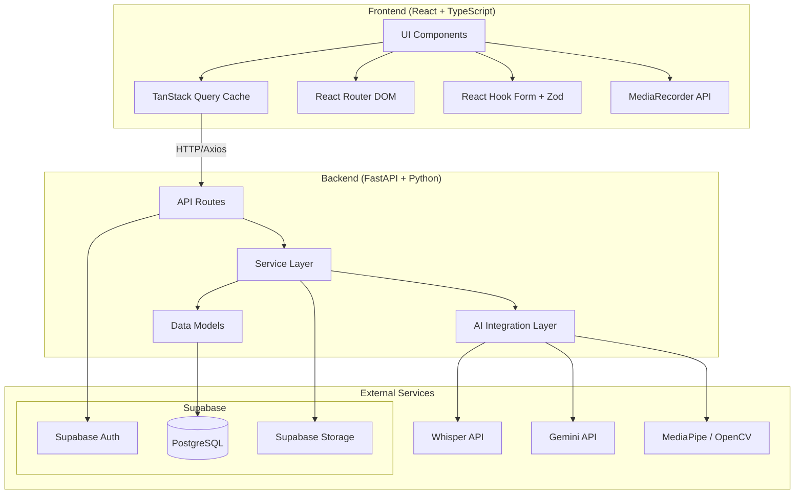
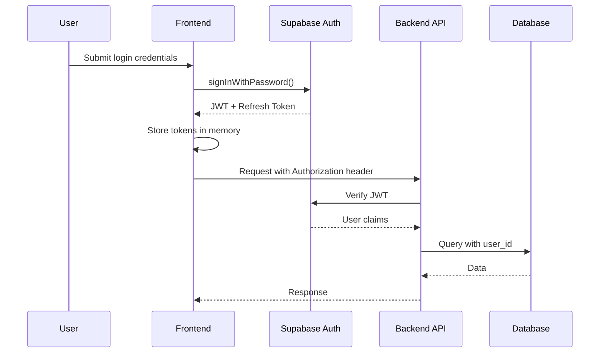
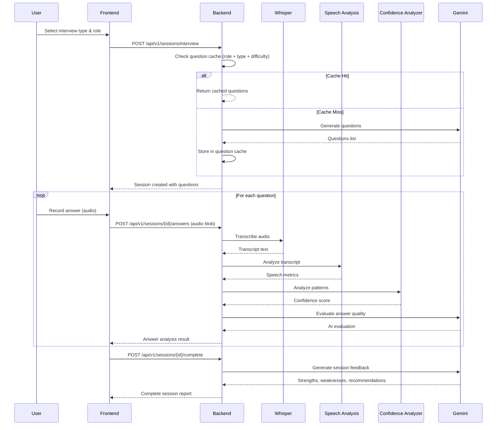
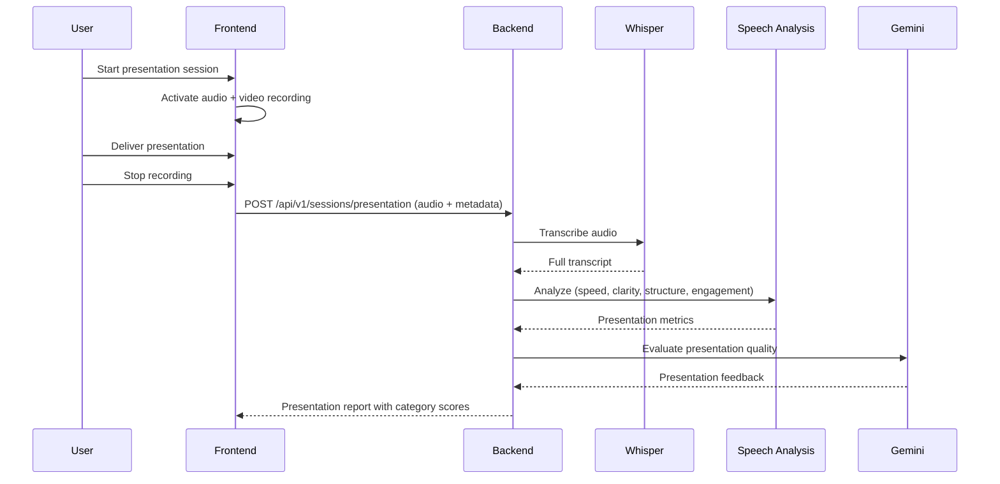
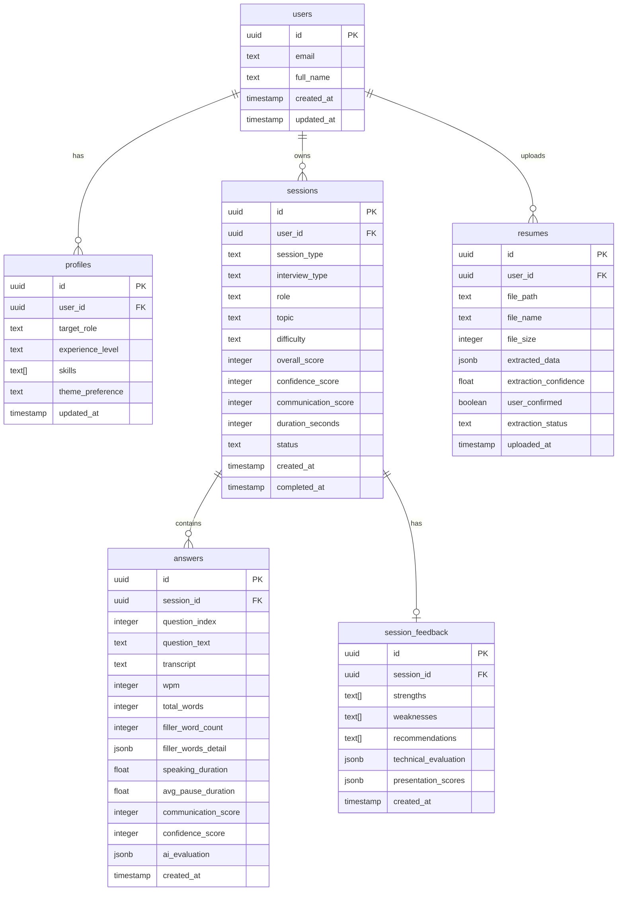
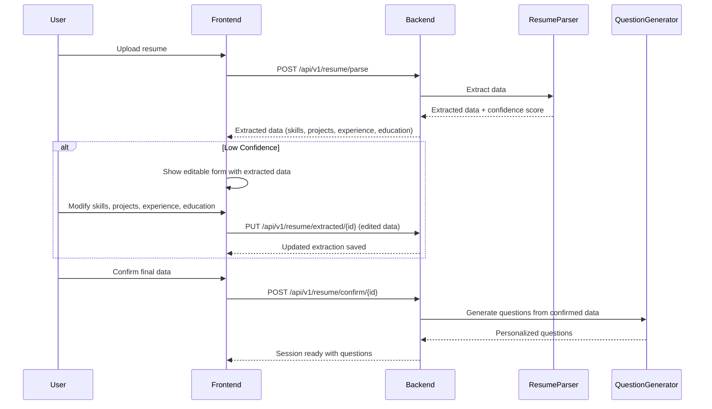

# Design Document: AI Interview & Presentation Coach

## Overview

The AI Interview & Presentation Coach is a full-stack web application that helps users practice interview and presentation skills through AI-powered feedback. The system captures audio/video from practice sessions, processes speech through Whisper for transcription, analyzes delivery metrics algorithmically, evaluates content quality via Gemini API, and tracks progress over time.

The architecture follows a client-server model with a React SPA frontend communicating with a FastAPI backend. Supabase provides authentication, PostgreSQL database, and file storage. AI processing is handled server-side to keep API keys secure and manage compute resources.

### Development Phases

- **Phase 1 (MVP):** Authentication, Profile Management, Dashboard, Interview Sessions (HR, Technical, Behavioral, Custom), Speech Analysis, Confidence Analysis, AI Feedback, Analytics, Session History, Landing Page
- **Phase 2:** Resume-Based Interviews, Presentation Coach, Advanced Analytics
- **Phase 3:** Eye Contact Analysis, Head Pose Analysis, MediaPipe Integration

### Architecture Principles

The generated code should resemble a production SaaS application built by a professional engineering team. The following principles are enforced throughout:

- **Clean Architecture:** Clear separation of layers (API, service, repository, integration)
- **SOLID Principles:** Single responsibility, open/closed, Liskov substitution, interface segregation, dependency inversion
- **Separation of Concerns:** UI components do not contain business logic; services do not contain rendering
- **TypeScript Strict Mode:** All frontend code compiled with `strict: true` in tsconfig
- **Reusable Components:** Shared UI primitives (via shadcn/ui) and custom shared components
- **Strong Typing:** No `any` types; all API responses, props, and state typed explicitly
- **Scalable Folder Structure:** Feature-based architecture with co-located components, hooks, services, and schemas
- **Testable Modules:** Pure business logic extracted into testable service functions
- **Production-Ready Code:** Error boundaries, loading states, accessibility, and graceful degradation

### Code Organization Constraints

> **Reference:** Requirement 18 (Code Organization and Maintainability)

- No single frontend or backend source file SHALL exceed 600 lines of code
- Large pages SHALL be split into smaller focused components (e.g., sections, modals, forms)
- Business logic SHALL reside in dedicated service or utility modules, never in UI components
- API communication SHALL be isolated in dedicated service files (e.g., `authService.ts`, `interviewService.ts`)
- Feature-based architecture SHALL be enforced: related components, hooks, services, and utilities co-located within feature directories
- Shared UI components SHALL live in `shared/components/` accessible to all feature modules

## Architecture

### High-Level System Diagram



### Authentication Flow



### Interview Session Flow



### Presentation Session Flow



## Components and Interfaces

### Frontend Architecture (Feature-Based)

```
src/
├── app/
│   ├── App.tsx
│   ├── routes.tsx
│   └── providers.tsx
├── features/
│   ├── auth/
│   │   ├── components/
│   │   │   ├── LoginForm.tsx
│   │   │   ├── RegisterForm.tsx
│   │   │   ├── ForgotPasswordForm.tsx
│   │   │   └── ResetPasswordForm.tsx
│   │   ├── hooks/
│   │   │   └── useAuth.ts
│   │   ├── services/
│   │   │   └── authService.ts
│   │   ├── schemas/
│   │   │   └── authSchemas.ts
│   │   └── pages/
│   │       ├── LoginPage.tsx
│   │       └── RegisterPage.tsx
│   ├── dashboard/
│   │   ├── components/
│   │   │   ├── MetricsCards.tsx
│   │   │   ├── WeeklyChart.tsx
│   │   │   ├── RecentSessions.tsx
│   │   │   └── OnboardingState.tsx
│   │   ├── hooks/
│   │   │   └── useDashboard.ts
│   │   ├── services/
│   │   │   └── dashboardService.ts
│   │   └── pages/
│   │       └── DashboardPage.tsx
│   ├── interview/
│   │   ├── components/
│   │   │   ├── InterviewSetup.tsx
│   │   │   ├── QuestionDisplay.tsx
│   │   │   ├── AudioRecorder.tsx
│   │   │   ├── AnswerFeedback.tsx
│   │   │   └── SessionReport.tsx
│   │   ├── hooks/
│   │   │   ├── useInterview.ts
│   │   │   └── useAudioRecorder.ts
│   │   ├── services/
│   │   │   └── interviewService.ts
│   │   ├── schemas/
│   │   │   └── interviewSchemas.ts
│   │   └── pages/
│   │       ├── InterviewSetupPage.tsx
│   │       └── InterviewSessionPage.tsx
│   ├── presentation/
│   │   ├── components/
│   │   │   ├── PresentationSetup.tsx
│   │   │   ├── PresentationRecorder.tsx
│   │   │   └── PresentationReport.tsx
│   │   ├── hooks/
│   │   │   ├── usePresentation.ts
│   │   │   └── useVideoRecorder.ts
│   │   ├── services/
│   │   │   └── presentationService.ts
│   │   └── pages/
│   │       ├── PresentationSetupPage.tsx
│   │       └── PresentationSessionPage.tsx
│   ├── analytics/
│   │   ├── components/
│   │   │   ├── ScoreTrendChart.tsx
│   │   │   ├── SessionFrequencyChart.tsx
│   │   │   ├── TimeRangeSelector.tsx
│   │   │   └── MetricBreakdown.tsx
│   │   ├── hooks/
│   │   │   └── useAnalytics.ts
│   │   ├── services/
│   │   │   └── analyticsService.ts
│   │   └── pages/
│   │       └── AnalyticsPage.tsx
│   ├── history/
│   │   ├── components/
│   │   │   ├── SessionList.tsx
│   │   │   ├── SessionCard.tsx
│   │   │   ├── SessionDetail.tsx
│   │   │   └── SessionFilters.tsx
│   │   ├── hooks/
│   │   │   └── useSessionHistory.ts
│   │   ├── services/
│   │   │   └── historyService.ts
│   │   └── pages/
│   │       ├── HistoryPage.tsx
│   │       └── SessionDetailPage.tsx
│   ├── profile/
│   │   ├── components/
│   │   │   ├── ProfileForm.tsx
│   │   │   └── ResumeUpload.tsx
│   │   ├── hooks/
│   │   │   └── useProfile.ts
│   │   ├── services/
│   │   │   └── profileService.ts
│   │   └── pages/
│   │       └── ProfilePage.tsx
│   └── landing/
│       ├── components/
│       │   ├── Hero.tsx
│       │   ├── Features.tsx
│       │   ├── HowItWorks.tsx
│       │   ├── Benefits.tsx
│       │   ├── Testimonials.tsx
│       │   ├── Pricing.tsx
│       │   └── FAQ.tsx
│       └── pages/
│           └── LandingPage.tsx
├── shared/
│   ├── components/
│   │   ├── ui/ (shadcn/ui components)
│   │   ├── Layout.tsx
│   │   ├── Navbar.tsx
│   │   ├── Sidebar.tsx
│   │   ├── Footer.tsx
│   │   ├── LoadingSpinner.tsx
│   │   ├── ErrorMessage.tsx
│   │   └── ThemeToggle.tsx
│   ├── hooks/
│   │   ├── useTheme.ts
│   │   └── useMediaDevices.ts
│   ├── lib/
│   │   ├── axios.ts
│   │   ├── supabase.ts
│   │   └── utils.ts
│   └── types/
│       └── index.ts
└── main.tsx
```

### Backend Architecture (Clean Architecture)

```
app/
├── main.py
├── config.py
├── dependencies.py
├── api/
│   ├── __init__.py
│   ├── routes/
│   │   ├── auth.py
│   │   ├── profile.py
│   │   ├── sessions.py
│   │   ├── interview.py
│   │   ├── presentation.py
│   │   ├── analytics.py
│   │   └── history.py
│   ├── middleware/
│   │   ├── auth_middleware.py
│   │   ├── error_handler.py
│   │   └── rate_limiter.py
│   └── schemas/
│       ├── auth_schemas.py
│       ├── session_schemas.py
│       ├── interview_schemas.py
│       ├── presentation_schemas.py
│       ├── analytics_schemas.py
│       └── common_schemas.py
├── services/
│   ├── __init__.py
│   ├── auth_service.py
│   ├── profile_service.py
│   ├── question_generator.py
│   ├── question_cache_service.py
│   ├── transcription_service.py
│   ├── speech_analysis_service.py
│   ├── confidence_analyzer.py
│   ├── ai_feedback_service.py
│   ├── resume_parser.py
│   ├── analytics_service.py
│   ├── session_service.py
│   └── presentation_service.py
├── models/
│   ├── __init__.py
│   ├── user.py
│   ├── session.py
│   ├── answer.py
│   ├── feedback.py
│   └── analytics.py
├── repositories/
│   ├── __init__.py
│   ├── user_repository.py
│   ├── session_repository.py
│   └── analytics_repository.py
├── integrations/
│   ├── __init__.py
│   ├── supabase_client.py
│   ├── whisper_client.py
│   ├── gemini_client.py
│   └── mediapipe_client.py
└── utils/
    ├── __init__.py
    ├── audio_utils.py
    ├── text_utils.py
    └── validators.py
```

### API Endpoints

> **API Versioning:** All endpoints are prefixed with `/api/v1/` to support future backward-compatible API evolution.

#### Authentication

| Method | Endpoint | Description |
|--------|----------|-------------|
| POST | `/api/v1/auth/register` | Register new user |
| POST | `/api/v1/auth/login` | Login with credentials |
| POST | `/api/v1/auth/logout` | Logout and invalidate token |
| POST | `/api/v1/auth/forgot-password` | Request password reset |
| POST | `/api/v1/auth/reset-password` | Reset password with token |

#### Profile

| Method | Endpoint | Description |
|--------|----------|-------------|
| GET | `/api/v1/profile` | Get current user profile |
| PUT | `/api/v1/profile` | Update profile info |
| POST | `/api/v1/profile/resume` | Upload resume file |
| GET | `/api/v1/profile/resume` | Get resume metadata |

#### Interview Sessions

| Method | Endpoint | Description |
|--------|----------|-------------|
| POST | `/api/v1/sessions/interview` | Create new interview session |
| GET | `/api/v1/sessions/interview/{id}` | Get interview session details |
| POST | `/api/v1/sessions/interview/{id}/answers` | Submit an answer (audio) |
| POST | `/api/v1/sessions/interview/{id}/complete` | Complete session & get report |

#### Technical Interview

| Method | Endpoint | Description |
|--------|----------|-------------|
| POST | `/api/v1/sessions/technical` | Create technical interview session |
| POST | `/api/v1/sessions/technical/{id}/answers` | Submit technical answer |
| GET | `/api/v1/sessions/technical/{id}/evaluation` | Get evaluation breakdown |
| POST | `/api/v1/sessions/technical/{id}/follow-up` | Get follow-up question |

#### Resume-Based Interview

| Method | Endpoint | Description |
|--------|----------|-------------|
| POST | `/api/v1/resume/parse` | Parse uploaded resume |
| GET | `/api/v1/resume/extracted/{id}` | Get extracted resume data |
| PUT | `/api/v1/resume/extracted/{id}` | Manually edit extracted data (skills, projects, experience, education) |
| POST | `/api/v1/resume/confirm/{id}` | Confirm extracted data (generates questions only after confirmation) |
| POST | `/api/v1/sessions/resume-interview` | Start resume-based session |

#### Presentation Sessions

| Method | Endpoint | Description |
|--------|----------|-------------|
| POST | `/api/v1/sessions/presentation` | Create presentation session |
| POST | `/api/v1/sessions/presentation/{id}/recording` | Upload recording |
| POST | `/api/v1/sessions/presentation/{id}/materials` | Upload materials |
| POST | `/api/v1/sessions/presentation/{id}/complete` | Complete & get report |

#### Analytics

| Method | Endpoint | Description |
|--------|----------|-------------|
| GET | `/api/v1/analytics/overview` | Get dashboard metrics |
| GET | `/api/v1/analytics/progress` | Get progress data with time range |
| GET | `/api/v1/analytics/trends` | Get score trends |

#### Session History

| Method | Endpoint | Description |
|--------|----------|-------------|
| GET | `/api/v1/history` | List sessions (paginated, filtered) |
| GET | `/api/v1/history/{id}` | Get full session detail |

### Key Interfaces

```typescript
// Frontend Service Interface
interface InterviewService {
  createSession(config: InterviewConfig): Promise<InterviewSession>;
  submitAnswer(sessionId: string, audio: Blob): Promise<AnswerAnalysis>;
  completeSession(sessionId: string): Promise<SessionReport>;
}

interface InterviewConfig {
  type: 'hr' | 'technical' | 'behavioral' | 'custom';
  role: string;
  topic?: string;          // For technical interviews
  difficulty?: 'beginner' | 'intermediate' | 'advanced';
  questionCount?: number;
}

interface AnswerAnalysis {
  transcript: string;
  speechMetrics: SpeechMetrics;
  confidenceScore: number;
  aiEvaluation: AIEvaluation;
}

interface SpeechMetrics {
  wpm: number;
  totalWords: number;
  fillerWordCount: number;
  fillerWords: Record<string, number>;
  speakingDuration: number;
  averagePauseDuration: number;
  communicationScore: number;
  wpmInRange: boolean;
}

interface SessionReport {
  overallScore: number;
  confidenceScore: number;
  communicationScore: number;
  strengths: string[];
  weaknesses: string[];
  recommendations: string[];
  answers: AnswerAnalysis[];
}
```

```python
# Backend Service Interface
class SpeechAnalysisService:
    def analyze(self, transcript: str, duration_seconds: float) -> SpeechMetrics:
        """Compute speech metrics from transcript and duration."""
        ...

class ConfidenceAnalyzer:
    def analyze(
        self,
        transcript: str,
        hesitation_count: int,
        pause_frequency: float,
        speech_flow_score: float,
        response_completeness: float
    ) -> ConfidenceResult:
        """Compute confidence score from speech patterns."""
        ...

class AIFeedbackService:
    async def generate_feedback(
        self,
        session_data: SessionData,
        speech_metrics: SpeechMetrics,
        confidence_score: float
    ) -> FeedbackReport:
        """Generate AI feedback via Gemini API."""
        ...

class QuestionGenerator:
    async def generate_questions(
        self,
        interview_type: str,
        role: str,
        topic: Optional[str] = None,
        difficulty: Optional[str] = None,
        resume_data: Optional[dict] = None
    ) -> list[Question]:
        """
        Generate interview questions. Uses cache for non-resume requests;
        falls back to Gemini API on cache miss.
        """
        ...
```

## Data Models

### Database Schema (PostgreSQL via Supabase)



### Key Data Types

```python
# Pydantic Models (Backend)
from pydantic import BaseModel, Field
from typing import Optional
from uuid import UUID
from datetime import datetime
from enum import Enum

class SessionType(str, Enum):
    INTERVIEW = "interview"
    PRESENTATION = "presentation"

class InterviewType(str, Enum):
    HR = "hr"
    TECHNICAL = "technical"
    BEHAVIORAL = "behavioral"
    CUSTOM = "custom"
    RESUME_BASED = "resume_based"

class Difficulty(str, Enum):
    BEGINNER = "beginner"
    INTERMEDIATE = "intermediate"
    ADVANCED = "advanced"

class SessionStatus(str, Enum):
    IN_PROGRESS = "in_progress"
    COMPLETED = "completed"
    FAILED = "failed"

class SpeechMetrics(BaseModel):
    wpm: int
    total_words: int
    filler_word_count: int
    filler_words_detail: dict[str, int]
    speaking_duration: float
    avg_pause_duration: float
    communication_score: int = Field(ge=0, le=100)
    wpm_in_range: bool

class ConfidenceResult(BaseModel):
    score: int = Field(ge=0, le=100)
    hesitation_count: int
    pause_frequency: float
    speech_flow_score: float
    response_completeness: float

class FeedbackReport(BaseModel):
    strengths: list[str] = Field(min_length=2)
    weaknesses: list[str] = Field(min_length=2)
    recommendations: list[str] = Field(min_length=3)
    technical_evaluation: Optional[dict] = None
    presentation_scores: Optional[dict] = None

class PresentationScores(BaseModel):
    speaking_speed: int = Field(ge=0, le=100)
    clarity: int = Field(ge=0, le=100)
    structure: int = Field(ge=0, le=100)
    communication: int = Field(ge=0, le=100)
    engagement: int = Field(ge=0, le=100)
```

### Footer Component (`shared/components/Footer.tsx`)

The Footer component is a shared UI element visible on all public pages (landing, login, register) and optionally in the authenticated layout.

**Contents:**
- Creator Name (configurable via `VITE_CREATOR_NAME` environment variable)
- GitHub Profile Link (configurable via `VITE_GITHUB_URL` environment variable) — opens in new tab (`target="_blank"`)
- LinkedIn Profile Link (configurable via `VITE_LINKEDIN_URL` environment variable) — opens in new tab (`target="_blank"`)
- Current Year (dynamically computed)
- Copyright Text

**Requirements:**
- All links open in new tabs with `rel="noopener noreferrer"`
- Fully responsive across desktop, tablet, and mobile viewports
- Visible on all public pages
- All content configurable via environment variables (never hardcoded)

**Example rendering:** `Created by John Doe | GitHub | LinkedIn | © 2026 AI Interview & Presentation Coach`

### Question Generation Cache Layer (`services/question_cache_service.py`)

The Question Cache Service reduces Gemini API usage by caching previously generated questions keyed by the combination of role, interview type, topic, and difficulty level.

**Behavior:**
1. Before calling Gemini, the `QuestionGenerator` checks the cache for an existing question set matching the requested parameters
2. On **cache hit**: return cached questions immediately (no Gemini API call)
3. On **cache miss**: call Gemini API, store the generated questions in cache, then return
4. Cache key: `{interview_type}:{role}:{topic}:{difficulty}` (normalized to lowercase)
5. Cache entries have a configurable TTL (default 24 hours) to ensure question freshness
6. Resume-based questions are never cached (they are personalized per user)

**Interface:**
```python
class QuestionCacheService:
    async def get_cached_questions(
        self,
        interview_type: str,
        role: str,
        topic: Optional[str] = None,
        difficulty: Optional[str] = None
    ) -> Optional[list[Question]]:
        """Return cached questions if available, None on miss."""
        ...

    async def cache_questions(
        self,
        interview_type: str,
        role: str,
        questions: list[Question],
        topic: Optional[str] = None,
        difficulty: Optional[str] = None
    ) -> None:
        """Store generated questions in cache."""
        ...

    async def invalidate_cache(self, pattern: Optional[str] = None) -> None:
        """Invalidate cache entries matching pattern, or all if None."""
        ...
```

### Resume Parsing Fallback Flow

When the Resume Parser's extraction confidence is low, the system supports manual editing before question generation:



**Key constraints:**
- Questions are ONLY generated after the user explicitly confirms the extracted data
- Users may modify any field: skills, projects, experience, education
- The editable form is always shown (not just on low confidence), but low-confidence fields are highlighted
- Confirmation is a required step — no automatic question generation

### Future Scalability Placeholders

The architecture is designed to support the following future capabilities without major structural changes:

| Future Feature | Architectural Support |
|----------------|----------------------|
| **Admin Dashboard** | Backend already uses role-based patterns via Supabase Auth; add `admin` role and admin-specific routes in `api/routes/admin.py` |
| **Subscription Plans** | User model can be extended with `subscription_tier`; add `billing_service.py` and integrate with payment provider |
| **Usage Monitoring** | Middleware layer already tracks requests; extend with per-user quotas and usage counters in the database |
| **AI Provider Switching** | `integrations/` layer abstracts AI clients; add alternative providers (OpenAI, Claude) behind a common interface with config-based selection |
| **Mobile Application Support** | API is REST-based and stateless; mobile clients can consume the same endpoints; add API versioning via URL prefix (`/api/v1/`) |


## Correctness Properties

*A property is a characteristic or behavior that should hold true across all valid executions of a system—essentially, a formal statement about what the system should do. Properties serve as the bridge between human-readable specifications and machine-verifiable correctness guarantees.*

### Property 1: Speech analysis produces valid metrics for any transcript

*For any* non-empty transcript string and positive duration value, the Speech Analysis Engine SHALL produce a result containing: wpm (non-negative integer), total_words (non-negative integer), filler_word_count (non-negative integer), speaking_duration (positive float), avg_pause_duration (non-negative float), and communication_score (integer between 0 and 100 inclusive).

**Validates: Requirements 4.4, 7.3, 8.4**

### Property 2: WPM calculation mathematical correctness

*For any* transcript with a known word count W and a known positive duration D seconds, the Speech Analysis Engine SHALL compute WPM equal to W / (D / 60), rounded to the nearest integer.

**Validates: Requirements 8.1**

### Property 3: Filler word detection accuracy

*For any* transcript string containing known filler words (um, uh, like, actually, basically, you know) at known positions, the Speech Analysis Engine SHALL detect and count each filler word occurrence, producing a total filler_word_count equal to the sum of all filler word occurrences and a filler_words_detail map with correct per-word counts.

**Validates: Requirements 8.2**

### Property 4: Communication score bounds and monotonicity

*For any* valid combination of WPM, filler word frequency, and pause pattern metrics, the Speech Analysis Engine SHALL produce a communication_score between 0 and 100 inclusive. Furthermore, for any two inputs where one has WPM closer to the ideal range (120-160), lower filler word frequency, AND shorter average pause duration, that input SHALL receive a communication_score greater than or equal to the other.

**Validates: Requirements 8.3**

### Property 5: WPM range flag correctness

*For any* computed WPM value, the Speech Analysis Engine SHALL set wpm_in_range to true if and only if WPM is between 120 and 160 inclusive, and false otherwise.

**Validates: Requirements 8.5**

### Property 6: Confidence score bounds and determinism

*For any* valid input parameters (hesitation_count >= 0, pause_frequency >= 0, speech_flow_score in [0,1], response_completeness in [0,1]), the Confidence Analyzer SHALL produce a score between 0 and 100 inclusive. For identical inputs, the score SHALL be identical. For any two inputs where one has lower hesitation_count, lower pause_frequency, higher speech_flow_score, AND higher response_completeness, that input SHALL receive a confidence_score greater than or equal to the other.

**Validates: Requirements 9.1, 9.2**

### Property 7: Low confidence triggers improvement recommendations

*For any* session where the computed confidence_score is between 1 and 49 inclusive, the AI Feedback Engine output SHALL include at least one recommendation specifically addressing confidence improvement.

**Validates: Requirements 9.3**

### Property 8: Feedback minimum structure

*For any* completed session data provided to the AI Feedback Engine, the generated feedback report SHALL contain at least 2 strengths, at least 2 weaknesses, and at least 3 recommendations.

**Validates: Requirements 10.2**

### Property 9: Forgot password response uniformity

*For any* email address string (whether registered or not), the forgot-password endpoint SHALL return an identical response structure and HTTP status code, preventing email enumeration.

**Validates: Requirements 1.4**

### Property 10: Invalid login error uniformity

*For any* invalid credential pair (wrong email, wrong password, or both), the login endpoint SHALL return an identical generic error message structure, preventing credential enumeration.

**Validates: Requirements 1.8**

### Property 11: Protected route redirect for unauthenticated access

*For any* protected route path in the application, an unauthenticated request SHALL result in a redirect to the login page (HTTP 401/redirect response).

**Validates: Requirements 1.6**

### Property 12: Input validation produces field-specific structured errors

*For any* API request containing invalid field data, the server SHALL return a structured error response where each invalid field is identified by name with a specific error message, and the HTTP status is 422.

**Validates: Requirements 1.7, 17.5**

### Property 13: Profile update round-trip persistence

*For any* valid profile data (target_role, experience_level, skills), saving the profile and then retrieving it SHALL return data equivalent to what was saved.

**Validates: Requirements 2.1**

### Property 14: File size validation enforcement

*For any* file upload where the file size exceeds 10 MB (10,485,760 bytes), the Platform SHALL reject the upload. For any file upload where the file size is at most 10 MB, the Platform SHALL NOT reject the upload based on size alone.

**Validates: Requirements 2.3**

### Property 15: Dashboard aggregation correctness

*For any* set of completed sessions belonging to a user, the Dashboard SHALL display: total_interview_sessions equal to the count of interview-type sessions, total_presentation_sessions equal to the count of presentation-type sessions, average_score equal to the arithmetic mean of all session overall_scores, and the most recent confidence_score and communication_score from the latest session.

**Validates: Requirements 3.1**

### Property 16: Time period bucketing correctness

*For any* set of sessions with known timestamps, the Analytics Service SHALL correctly bucket sessions into daily (by calendar day), weekly (by ISO week), and monthly (by calendar month) groups with accurate counts and metric aggregations per bucket.

**Validates: Requirements 3.2, 11.1**

### Property 17: Session list sorted by date with correct limiting

*For any* set of N sessions, retrieving the session list SHALL return sessions sorted by created_at descending (most recent first). When retrieving recent sessions for the dashboard, exactly min(5, N) sessions SHALL be returned.

**Validates: Requirements 3.3, 12.1**

### Property 18: Session filtering by type and time range

*For any* set of sessions and any filter combination of session_type and date_range, the filtered result SHALL contain exactly those sessions that match ALL specified filter criteria and no others.

**Validates: Requirements 11.3, 12.5**

### Property 19: Analytics trend computation per category

*For any* set of sessions with known scores over a time period, the Analytics Service SHALL compute trend data for overall_score, confidence_score, and communication_score as independent series, where each data point represents the average of that metric for the corresponding time bucket.

**Validates: Requirements 11.4**

### Property 20: Pagination correctness

*For any* total session count N > 20, the paginated results SHALL return pages of exactly 20 items each (except the final page which may have fewer), the total number of pages SHALL equal ceil(N / 20), and the union of all pages SHALL contain all N sessions without duplicates.

**Validates: Requirements 12.4**

### Property 21: Session list entries include required fields

*For any* session returned in a history list response, the entry SHALL include non-null values for session_type, created_at (date), duration_seconds, and overall_score.

**Validates: Requirements 12.2**

### Property 22: Eye contact percentage calculation

*For any* sequence of gaze classification frames (each labeled as "camera" or "away"), the eye contact percentage SHALL equal (count of "camera" frames / total frames) × 100, rounded to one decimal place.

**Validates: Requirements 13.2**

### Property 23: Head pose stability classification

*For any* sequence of head pose measurements (pitch, yaw, roll values), the stability metric SHALL classify movement as "stable" when the standard deviation of each axis is below the configured threshold, and "excessive" when any axis exceeds the threshold.

**Validates: Requirements 13.4**

### Property 24: Theme preference persistence round-trip

*For any* valid theme preference value ("light" or "dark"), saving the preference and then retrieving it on a subsequent visit SHALL return the same preference value.

**Validates: Requirements 15.3**

### Property 25: Session data persistence round-trip

*For any* completed session with known transcript, scores, feedback, duration, and date, persisting the session and then retrieving it by ID SHALL return data equivalent to what was persisted.

**Validates: Requirements 16.1**

### Property 26: Data isolation per user

*For any* two distinct users A and B, querying sessions, analytics, or files for user A SHALL never return data belonging to user B, and vice versa.

**Validates: Requirements 16.4**

### Property 27: Client/server validation consistency

*For any* input payload and corresponding Zod schema, the client-side validation result (accept/reject) SHALL match the server-side validation result for the same input.

**Validates: Requirements 17.4**

## Error Handling

### Frontend Error Handling Strategy

| Error Type | Handling Approach |
|------------|-------------------|
| Network failure | Display toast notification with retry button; TanStack Query handles automatic retries for queries |
| Authentication expiry | Intercept 401 responses in Axios interceptor, attempt token refresh, redirect to login if refresh fails |
| Validation errors | Display field-specific errors inline using React Hook Form's error state |
| Microphone/camera denial | Display modal explaining how to grant permissions with platform-specific instructions |
| File upload failure | Display error with option to retry; preserve form state |
| API timeout | Display "Taking longer than expected" message with cancel/retry options |

### Backend Error Handling Strategy

| Error Type | Handling Approach |
|------------|-------------------|
| Validation failure | Return 422 with structured `{detail: [{field, message, type}]}` response |
| Authentication failure | Return 401 with generic message (no information leakage) |
| Authorization failure | Return 403 with "Forbidden" message |
| Resource not found | Return 404 with resource type in message |
| Gemini API error/timeout | Retry once with exponential backoff; return 503 if retry fails |
| Whisper API error | Retry once; return 503 with user-friendly message if retry fails |
| Database write failure | Retry once; return 500 if retry fails with transaction rollback |
| File too large | Return 413 with maximum size in error message |
| Rate limit exceeded | Return 429 with retry-after header |

### Error Response Format

```python
class ErrorResponse(BaseModel):
    error: str              # Error category
    message: str            # User-friendly message
    details: Optional[list[FieldError]] = None  # Field-specific errors

class FieldError(BaseModel):
    field: str              # Field name
    message: str            # Field-specific error message
    type: str               # Error type (e.g., "required", "invalid_format")
```

### Retry Strategy

```python
# Retry configuration for external services
RETRY_CONFIG = {
    "gemini_api": {"max_retries": 1, "backoff_factor": 2, "timeout": 45},
    "whisper_api": {"max_retries": 1, "backoff_factor": 1, "timeout": 30},
    "database": {"max_retries": 1, "backoff_factor": 0.5, "timeout": 5},
}
```

## Environment Variables

### Frontend (.env)

| Variable | Description |
|----------|-------------|
| `VITE_API_URL` | Backend API base URL (e.g., `http://localhost:8000`) |
| `VITE_SUPABASE_URL` | Supabase project URL |
| `VITE_SUPABASE_ANON_KEY` | Supabase anonymous/public key for client-side auth |
| `VITE_CREATOR_NAME` | Creator name displayed in the footer |
| `VITE_GITHUB_URL` | Creator's GitHub profile URL (footer link) |
| `VITE_LINKEDIN_URL` | Creator's LinkedIn profile URL (footer link) |

### Backend (.env)

| Variable | Description |
|----------|-------------|
| `SUPABASE_URL` | Supabase project URL |
| `SUPABASE_SERVICE_ROLE_KEY` | Supabase service role key (server-side, full access) |
| `GEMINI_API_KEY` | Google Gemini API key for AI generation |
| `WHISPER_API_KEY` | OpenAI Whisper API key for speech-to-text |
| `DATABASE_URL` | PostgreSQL connection string (Supabase) |
| `JWT_SECRET` | Secret used for JWT token verification |

**Security Notes:**
- Backend `.env` contains secrets and MUST NOT be committed to version control
- Frontend `VITE_` prefixed variables are exposed to the browser — only public keys allowed
- Both `.env` files should be listed in `.gitignore`
- Use `.env.example` files with placeholder values for documentation

## Testing Strategy

### Testing Approach

The testing strategy uses a dual approach combining example-based unit tests with property-based tests for comprehensive coverage.

### Property-Based Testing

**Library:** [Hypothesis](https://hypothesis.readthedocs.io/) (Python) for backend services

Property-based testing is applicable to this feature because:
- The Speech Analysis Engine and Confidence Analyzer are pure functions with clear input/output behavior
- Universal properties (score bounds, mathematical correctness, monotonicity) hold across a wide input space
- The input space for transcripts, durations, and metric combinations is large
- Validation logic, filtering, pagination, and aggregation all have universal properties

**Configuration:**
- Minimum 100 iterations per property test
- Each property test tagged with: `Feature: ai-interview-coach, Property {number}: {property_text}`
- Use `@given` decorators with custom strategies for transcript generation

### Unit Tests (Example-Based)

| Area | Focus |
|------|-------|
| Auth flows | Login success/failure, registration, password reset |
| Profile CRUD | Valid updates, file uploads |
| Session lifecycle | Creation, answer submission, completion |
| Dashboard | Onboarding state, metric display |
| UI components | Rendering, interaction, accessibility |

### Integration Tests

| Area | Focus |
|------|-------|
| Supabase Auth | Registration, login, token refresh |
| Supabase Storage | File upload, access control |
| Whisper API | Transcription accuracy, timeout handling |
| Gemini API | Question generation, feedback generation |
| Database | Session persistence, query correctness |

### End-to-End Tests

| Flow | Coverage |
|------|----------|
| Full interview session | Setup → record → transcribe → analyze → feedback |
| Full presentation session | Setup → record → analyze → report |
| User journey | Register → profile → practice → review history |

### Test Organization

```
tests/
├── unit/
│   ├── test_speech_analysis.py      # Properties 1-5
│   ├── test_confidence_analyzer.py  # Property 6
│   ├── test_analytics_service.py    # Properties 15-20
│   ├── test_validation.py           # Properties 12, 14, 27
│   ├── test_session_service.py      # Properties 17, 18, 21, 25
│   └── test_auth_service.py         # Properties 9, 10, 11
├── integration/
│   ├── test_whisper_integration.py
│   ├── test_gemini_integration.py
│   ├── test_supabase_integration.py
│   └── test_mediapipe_integration.py
├── property/
│   ├── test_speech_properties.py    # Hypothesis property tests
│   ├── test_confidence_properties.py
│   ├── test_analytics_properties.py
│   ├── test_pagination_properties.py
│   └── test_validation_properties.py
└── e2e/
    ├── test_interview_flow.py
    └── test_presentation_flow.py
```
