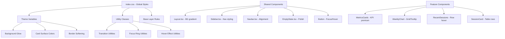

# Design Document: UI/UX Polish

## Overview

This design covers a comprehensive visual polish pass across the Preply AI frontend application. The changes are purely presentational — no behavioral modifications, API calls, routing, or data logic will be affected.

The approach leverages the existing Tailwind CSS v4 theming infrastructure (CSS custom properties via `@theme` and `.dark` class), the shadcn/ui component library (cva-based variants), and Recharts for chart styling. All modifications are achieved through CSS utility class changes and minimal component markup adjustments.

**Key Design Decisions:**
- All styling changes are implemented via Tailwind utility classes and CSS custom properties — no new runtime dependencies
- Existing component APIs remain unchanged; only className strings and internal markup styling are modified
- The `index.css` file receives new utility classes for global effects (background glow, transitions)
- Component-level changes are scoped to the specific files (Sidebar, Navbar, EmptyState, MetricsCards, etc.)

## Architecture

The UI polish follows a layered approach:



**Change Scope:**
1. **Global CSS (`index.css`)** — New utility classes, updated base styles, background glow
2. **Shared Components** — Layout, Sidebar, Navbar, EmptyState, Button, Skeleton
3. **Feature Components** — MetricsCards, WeeklyChart, RecentSessions, SessionCard
4. **No new files or dependencies** — All changes fit within existing structure

## Components and Interfaces

### 1. Global Background Enhancement (Requirement 1)

**File:** `src/index.css`

Add a new `.app-bg-glow` utility class for the radial blue glow background, applied at the Layout level:

```css
@layer utilities {
  .app-bg-glow {
    background: radial-gradient(ellipse 80% 50% at 50% 20%, hsl(220 70% 50% / 0.06), transparent);
  }
  .dark .app-bg-glow {
    background: radial-gradient(ellipse 80% 50% at 50% 20%, hsl(220 70% 50% / 0.08), transparent);
  }
}
```

**File:** `src/shared/components/Layout.tsx`

Apply the glow class to the root wrapper div:
```tsx
<div className="app-bg-glow flex min-h-screen flex-col overflow-x-hidden">
```

### 2. Spacing System (Requirement 2)

Spacing adjustments are applied component-by-component using Tailwind's built-in 8px-grid spacing scale (`space-y-6` = 24px, `space-y-8` = 32px, `p-4` = 16px, `p-6` = 24px, `gap-4` = 16px).

**Affected files:**
- `Layout.tsx` — main content area padding standardized to `p-6`
- Dashboard page — section gaps standardized to `space-y-6` (24px)
- Card internal padding — standardized to `p-6` (24px) for standard cards

### 3. Card Visual Enhancement (Requirement 3)

**Strategy:** Introduce a reusable card style pattern via updated Tailwind classes. Cards get an elevated surface color, softened borders, subtle shadow, and hover lift.

**Base card classes pattern:**
```
rounded-xl border border-border/50 bg-card shadow-sm
transition-all duration-200 ease-out
hover:shadow-md hover:-translate-y-0.5 hover:border-border
```

Key changes:
- `border-border/50` — softened border (50% opacity)
- `rounded-xl` — slightly larger radius for premium feel
- `hover:-translate-y-0.5` — 2px lift on hover
- `hover:shadow-md` — increased depth on hover
- `hover:border-border` — border highlight on hover
- `transition-all duration-200 ease-out` — smooth 200ms animation

**Elevated surface for dark mode:** Add a CSS custom property:
```css
.dark {
  --color-card: hsl(222.2 84% 6.5%);  /* slightly brighter than 4.9% bg */
}
```

### 4. Dashboard KPI Cards (Requirement 4)

**File:** `src/features/dashboard/components/MetricsCards.tsx`

Changes to `MetricCard`:
- Value text: `text-2xl font-bold` → `text-3xl font-extrabold`
- Icon container: Add a subtle radial glow behind the icon using a box-shadow matching the icon color
- Add the standard card hover effect classes
- Increase internal padding from `p-4` to `p-6`

Icon glow implementation:
```tsx
<div className={`flex h-9 w-9 items-center justify-center rounded-lg ${iconBgClass} shadow-[0_0_8px_0] shadow-current/20`}>
```

### 5. Chart Styling (Requirement 5)

**File:** `src/features/dashboard/components/WeeklyChart.tsx` (and analytics charts)

Changes:
- CartesianGrid stroke opacity: reduce to `stroke={colors.grid}` with `strokeOpacity={0.2}`
- Tooltip: already has `borderRadius: "8px"` — ensure box-shadow is present (it is)
- Grid color already derived from theme variable — keep using `--color-border`
- No functional changes to data display

### 6. Sidebar Navigation (Requirement 6)

**File:** `src/shared/components/Sidebar.tsx`

Active state enhancement:
```tsx
isActive
  ? "bg-blue-500/10 text-blue-600 dark:text-blue-400 border-l-2 border-blue-500 shadow-[inset_4px_0_8px_-4px] shadow-blue-500/20"
  : "text-muted-foreground hover:bg-accent hover:text-foreground"
```

Spacing adjustments:
- `gap-3` stays (12px between icon and text) ✓
- `space-y-1` → `space-y-2` (8px between items)
- Ensure vertical centering with `items-center`

Transition:
- Already has `transition-colors` — expand to `transition-all duration-200`

### 7. Navbar Alignment (Requirement 7)

**File:** `src/shared/components/Navbar.tsx`

Current state is already well-structured. Minor adjustments:
- Verify logo: `h-11 w-11 object-contain` (44px) ✓ — already correct
- Ensure header is `h-16` (64px) ✓ — already correct
- Nav items gap: `gap-2` (8px) ✓ — already correct
- All items vertically centered via `items-center` ✓
- Logo text: already renders "Preply" + "AI" in blue ✓

Only minor cleanup: ensure consistent `gap-2` minimum between all action items.

### 8. Button Styling (Requirement 8)

**File:** `src/shared/components/ui/button.tsx`

Update the base `cva` class string:
- Change `transition-colors` → `transition-all duration-200 ease-out`
- Update `disabled:opacity-50` (already correct)
- Add `disabled:cursor-not-allowed` (replace `disabled:pointer-events-none`)
- Update focus ring: `focus-visible:ring-2 focus-visible:ring-blue-500 focus-visible:ring-offset-2`

Size variant adjustments:
- `sm`: `h-8` (32px), `default`: `h-10` (40px) ✓, `lg`: `h-12` (48px)

### 9. Form Input Enhancement (Requirement 9)

**File:** `src/index.css` — extend the existing `.auth-input` utility:

```css
@layer utilities {
  .input-focus-glow {
    @apply transition-all duration-200 rounded-lg border border-border;
  }
  .input-focus-glow:focus {
    @apply border-blue-500 ring-[3px] ring-blue-500/30;
  }
}
```

Apply to form inputs across auth pages and profile page. The existing `auth-input` class already handles border-color transitions — extend it with the focus glow ring.

### 10. Table Row Enhancement (Requirement 10)

**File:** `src/features/history/components/SessionCard.tsx` and `RecentSessions.tsx`

Row-level changes:
- Add `hover:bg-accent/5` for subtle row highlight
- Ensure `px-4 py-3` (16px horizontal, 12px vertical) padding ✓
- Border color: `border-border/50` for softer appearance
- Typography: `text-sm` (14px) for body, `text-xs` (12px) for secondary text ✓

### 11. Empty State Improvement (Requirement 11)

**File:** `src/shared/components/EmptyState.tsx`

Updated structure:
- Icon container: `rounded-full bg-gradient-to-br from-muted to-muted/70 shadow-sm`
- Spacing: `mt-4` (16px after icon) ✓, `mt-2` (8px between title and desc), `mt-6` (24px before button) ✓
- Title: `text-lg font-semibold` (18px) ✓
- Description: `text-sm text-muted-foreground` (14px) ✓
- Container: minimum `py-12` (48px) vertical padding ✓ — already applied

### 12. Skeleton Loading States (Requirement 12)

**File:** `src/shared/components/ui/skeleton.tsx`

The skeleton base already uses `animate-pulse bg-muted` ✓. Ensure skeletons use consistent `bg-muted` color.

Usage guidance:
- Dashboard loading: use `MetricsCardsSkeleton` and `ChartSkeleton` (already exists)
- History loading: use `ListSkeleton` (already exists)
- Replace generic `LoadingSpinner` usage with content-shaped skeletons where layout is predictable

### 13. Global Animation Standards (Requirement 13)

**File:** `src/index.css`

Add a base-layer rule for interactive elements:
```css
@layer base {
  button, a, input, select, textarea, [role="button"] {
    @apply transition-all duration-200 ease-out;
  }
}
```

This ensures all interactive elements default to smooth 200ms transitions with ease-out timing. Specific components can override with longer durations (up to 300ms) where needed.

Properties transitioned: `color`, `background-color`, `border-color`, `box-shadow`, `transform`, `opacity` — all covered by `transition-all`.

### 14. Branding Consistency (Requirement 14)

**Files:** Sidebar.tsx, Navbar.tsx, Landing page, Auth pages

Logo pattern (consistent across all instances):
```tsx

<span className="font-bold">
  <span className="text-foreground">Preply </span>
  <span className="text-blue-600 dark:text-blue-500">AI</span>
</span>
```

Standardize logo image height to `h-10` (40px) across all placements for consistency, except Navbar which uses `h-11` (44px).

### 15. Color Palette Preservation (Requirement 15)

**No changes to color definitions.** The existing `@theme` and `.dark` blocks in `index.css` remain untouched. All polish work uses existing variables:
- `--color-background`, `--color-card`, `--color-border`
- `--color-chart-1` through `--color-chart-5`
- Blue accent: `text-blue-500` / `text-blue-600` (Tailwind built-in)

The only color addition is the slightly elevated card surface (`hsl(222.2 84% 6.5%)`) for dark mode card backgrounds to create depth distinction.

### 16. Accessibility Preservation (Requirement 16)

**Constraints:**
- All focus rings use `ring-blue-500` which maintains 3:1+ contrast against dark backgrounds
- Text contrast ratios are preserved (no foreground color changes, only background adjustments)
- Keyboard navigation order unchanged (no DOM restructuring)
- Responsive breakpoints untouched
- `disabled:cursor-not-allowed` replaces `disabled:pointer-events-none` to preserve focus accessibility on disabled buttons

### 17. Non-Functional Constraints (Requirement 17)

**Guarantees:**
- No modifications to React hooks, state management, or component props
- No modifications to API service functions or axios configurations
- No modifications to React Router routes or navigation logic
- No new runtime dependencies added
- All changes are limited to className strings, CSS utilities, and minor JSX structure for styling wrappers

## Data Models

No data models are affected by this feature. All changes are purely presentational. The existing TypeScript interfaces, API response types, and state shapes remain unchanged.

## Error Handling

No new error handling is required. This feature does not introduce new failure modes since all changes are CSS/styling-only. Existing error boundaries, error messages, and loading states continue to function unchanged.

The only consideration is graceful degradation: if a CSS custom property is missing (unlikely given the existing theme), Tailwind's fallback mechanism ensures elements still render with sensible defaults.

## Testing Strategy

### Why Property-Based Testing Does NOT Apply

This feature consists entirely of:
- CSS class modifications (colors, spacing, shadows, transitions)
- Visual hover/focus effects
- Static layout adjustments
- No data transformations, parsers, serializers, or business logic

PBT requires pure functions with universal properties that hold across many inputs. UI polish has no meaningful "input space" to randomize — a button either has the correct focus ring classes or it doesn't.

### Recommended Testing Approach

**1. Visual Regression Tests (Primary)**
- Snapshot tests using Vitest + React Testing Library to verify component render output
- Compare rendered className strings to ensure correct Tailwind classes are applied
- Use `@testing-library/react` to render components and assert on element attributes

**2. Example-Based Unit Tests**
- Test that Button variants render with correct transition and focus classes
- Test that Sidebar active state applies correct indicator classes
- Test that EmptyState renders with correct spacing and typography classes
- Test that MetricCard hover classes are present on interactive cards

**3. Interaction Tests**
- Verify focus-visible states are properly configured using keyboard simulation
- Verify hover states don't break accessibility (elements remain focusable)
- Verify disabled buttons show `cursor-not-allowed` and reduced opacity

**4. Manual Testing Checklist**
- Visual inspection across light/dark mode
- Keyboard navigation walkthrough
- Responsive breakpoint testing (mobile, tablet, desktop)
- Color contrast spot-checks with browser DevTools

**Test Configuration:**
- Test runner: Vitest (`vitest --run`)
- Testing library: `@testing-library/react` + `@testing-library/jest-dom`
- No additional testing dependencies needed (fast-check already present but unused for this feature)
